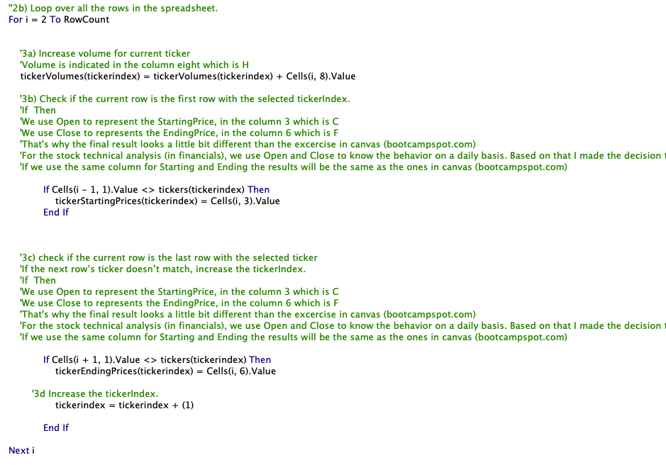
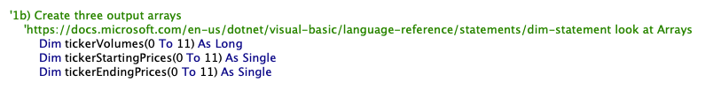
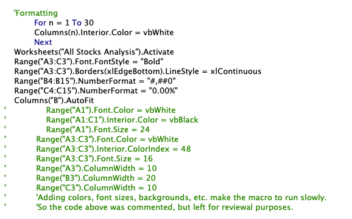
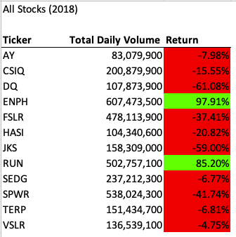
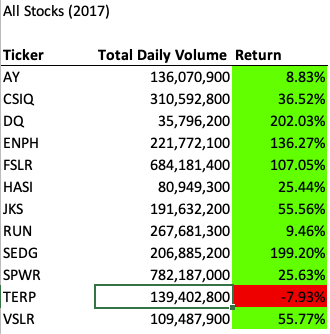
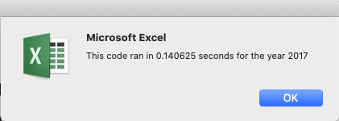
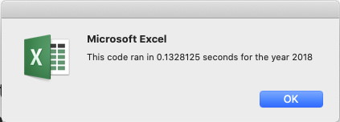

# Stock-Analysis Challenge
This is the repository for the Challenge01 July 04-2021

# Overview of the Project
As part of the Stock Analysis with the information provided in the Excel spreadsheets, we are now requested to lean the code with the aim of simplifying and making it faster at the execution level.
This new file was created based on the StockAnalysis file previously loaded.

# (1) Results
### 1.1 About the Loops
In the previous excercises, the macro's were reading several times the data in the spreadsheet, this was much more like iterations reading and reading again but looking for different information.
Based on the advisement and some lectures in the web, it was possible to simplify the code avoiding copying the same lines 12 times to get the results of 12 stock tickers.

### 1.2 Challenges
The information we were using during the course was very helpful. However, at financial information level there is something that created some noise in the information analysis.
We use "Open" to represent the StartingPrice, so the column 3 or C in 2017 and 2018 are used.
We use "Close" to represents the EndingPrice, so the column 6 or F in 2017 and 2018 are used.
That's why the final Return is not the same as the Bootcamp instructions.
Pointing to the same column (H or 8) in both cases (starting and ending prices) would have the same results as the bootcamp instructions. This was discovered during the course.

# (2) Results
### 2.1 About the Arrays
Another challenge was about the array definition with the aim of avoiding the need to copy the code 12 times.
By declaring the tickers as variables made the code simpler. 

### 2.1 About Formatting
Formatting the cells by the code might not be a good idea as it takes longer to display the results.
The amount of data was not huge. We are using a matrix of 3k,8  so, we consider it as a light spreadsheet.
Even though, by adding a white background, titles in colors, etc. made the code slower by about 4 times.
So the recomendation is to format data using Excel capabilities after gathering all the results.

These were the results under the premise that I used column 3 (C) which is Open, for the StartingPrices. And that I used column 6 (F) which is Close, for the EndingPrices.

# Conclusions
### 2.2 Conclusions about the single code in the green_stocks.xlsm vs VBA_Challenge.xlsm
The code in the green_stocks file yes is bigger, but has the ability to look at the whole spreadsheet looking for a registy without any restrictions beyond the column or matrix declared. In the other hand (as discussed during the sessions), the simplfied code considers that the data is already grouped and in sequence, making the analysis faster. So, the challenge for the simpified code is the ability to look and gather data when there is no order or sequence in the spreadsheet.
A cleaning might be required, or an improved code for those cases.

### 2.2 About the times of execution
There are many points to review and work on this topic.
Yes, the code is a little bit faster. In this case the data is not that big and the difference are just 1 or 2 seconds. 
The interesting point comes when we have a huge file to analyse and the simplified code is a must.
The most important test is the very first. The second analysis seems to remain in memory and the times vary a lot.

